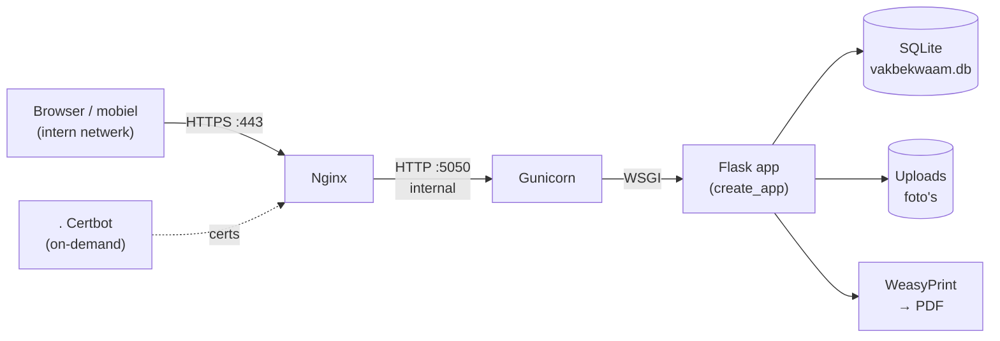

# Vakbekwaam Studio

> Webapplicatie voor team Vakbekwaamheid van Brandweer Limburg-Noord — om opleidings- en oefenmateriaal centraal te beheren en in een uniforme huisstijl als PDF te leveren.

---

## Wat doet de applicatie?

Vakbekwaam Studio is een interne webapp waar oefenleiders en redacteuren via formulieren **kaarten** invullen voor de operationele opleiding van de brandweer. De app maakt van die invoer automatisch een professionele PDF in de huisstijl van Brandweer Limburg-Noord — geen Word-templates, geen handwerk, geen afwijkende lay-outs.

Wat je er als gebruiker mee doet:

- **Themakaarten** opstellen — leidende principes, afspraken en verwijzingen rond een thema
- **Instructiekaarten** schrijven — werkwijze in stappen, met foto's en veiligheidsinstructies
- **Scenariokaarten** uitwerken — meldingstekst, scenariobeschrijving, ensceneringstips, evaluatiecriteria
- **Opdrachtkaarten** maken — leerdoelen, opdrachten en randvoorwaarden voor oefeningen
- **QR-codes** genereren die naar deze kaarten verwijzen — handig voor mobiel raadplegen tijdens oefeningen
- **Versies bijhouden** van elke kaart, plus zoeken/filteren op kerntaak (Brand, IBGS, THV, Water, etc.)

Doelgroep: ~30 medewerkers van team Vakbekwaamheid. Geen externe gebruikers, geen burger-facing functionaliteit.

---

## Technische opbouw

**Stack:**

| Laag | Technologie |
|---|---|
| Backend | Python 3.12, Flask 3.1, Flask-Login, Flask-WTF, Flask-SQLAlchemy |
| Database | SQLite (single-file, in `/app/instance/vakbekwaam.db`) |
| PDF-render | WeasyPrint 68 (HTML/CSS → PDF) |
| Frontend | Jinja2-templates, vanilla CSS via custom properties, geen build-step |
| QR-codes | `qrcode` Python-lib, on-the-fly PNG-generatie |
| WSGI-server | Gunicorn (2 workers × 4 threads) |
| Reverse proxy | Nginx (alpine), met optionele Let's Encrypt SSL |
| Deployment | Docker Compose |

**Architectuur (data-flow):**



**Mappenstructuur (broncode):**

```
app/
├── __init__.py        Flask app-factory + blueprint-registratie
├── models.py          SQLAlchemy-modellen (User, Kaart, QRCode, …) + DB-migraties
├── auth/              Login, logout, gebruikersbeheer (rollen: admin / redacteur / oefenleider)
├── main/              Dashboard
├── kaarten/           Formulieren + routes + PDF-generatie per kaarttype
├── qr/                Dynamische QR-codes (4 stijlen) + routes
├── templates/         Jinja2-templates (base.html = master layout)
└── static/            CSS (één bestand met variabelen), fonts (Frutiger), afbeeldingen

config.py              Productie-config via env-vars (SECRET_KEY, DATABASE_URL, …)
run.py                 Gunicorn-entrypoint (en `python run.py` voor lokale dev)
Dockerfile             Productie-image
docker-compose.yml     App + nginx + certbot
install.sh             One-line installer voor Ubuntu-VPS
update.sh              One-line updater voor bestaande installatie
```

Het Flask-app-factory-patroon (`create_app()`) zorgt dat alle blueprints, DB-init, schema-migraties en de seed van het admin-account bij elke start van de container netjes worden uitgevoerd. Gebruikers-wachtwoorden worden gehasht (Werkzeug PBKDF2). CSRF-protectie staat aan voor alle formulieren.

---

## IT-infrastructuur

### Wat IT moet voorzien

| Onderdeel | Eis |
|---|---|
| **VPS** | Ubuntu 22.04 LTS of 24.04 LTS (clean install), root SSH-toegang |
| **Subdomein** | DNS A-record naar het IPv4-adres van de VPS, vóór de installatie ingericht |
| **Firewall — inkomend** | Poort `80/tcp` en `443/tcp` open (rest dicht) |
| **Firewall — uitgaand** | Geen restricties (Docker pull, apt-get, certbot, GitHub) |
| **TLS-certificaat** | Wordt automatisch via Let's Encrypt opgevraagd door de installer |
| **Off-site backup** | IT regelt een externe backup van `/opt/vakbekwaam-studio/data/` (DB + uploads + certs) |

### Geschatte VPS-resources

Voor ~30 actieve gebruikers, met PDF-generatie als zwaarste workload:

| Resource | Minimum | Aanbevolen |
|---|---|---|
| **vCPU** | 1 | **2** (PDF-render is bursty) |
| **RAM** | 1 GB | **2 GB** |
| **Disk** | 15 GB SSD | **20–25 GB SSD** |
| **Bandbreedte** | 100 Mbit/s gedeeld | idem |
| **Verkeer/maand** | < 50 GB | idem |

Voorbeelden van geschikte VPS-aanbieders / instanties:

- Hetzner Cloud — `CX22` (€4,51/mnd, 2 vCPU / 4 GB / 40 GB) — ruim voldoende
- DigitalOcean — Basic Droplet 2 GB / 1 vCPU (≈ $12/mnd)
- Combell / OVH / Scaleway — vergelijkbare instances rond €5–10/mnd

### Onderhoudsverplichtingen

- Maandelijks `update.sh` draaien voor app- en security-updates
- Periodiek `apt upgrade` op het OS zelf
- Backup-restore eens per kwartaal testen
- Certbot-renewal verloopt automatisch via cron in de certbot-container (out-of-the-box)

---

## Installatie

Op een schone Ubuntu-VPS, met DNS-A-record al ingericht:

```bash
curl -fsSL https://raw.githubusercontent.com/RVHW97/Vakbekwaam-Studio/main/install.sh | sudo bash
```

Wat het script doet:

1. Vraagt om de **FQDN** (bv. `vakbekwaam.brandweerln.nl`)
2. Vraagt om een **admin e-mailadres** voor de eerste login
3. Vraagt of **SSL via Let's Encrypt** moet worden aangezet (J/n)
4. Installeert Docker + Docker Compose plugin (als nog niet aanwezig)
5. Cloned de repo naar `/opt/vakbekwaam-studio`
6. Genereert sterke `SECRET_KEY` en admin-wachtwoord
7. Bouwt + start de containers
8. Vraagt het Let's Encrypt-certificaat aan en zet HTTPS aan
9. **Toont aan het eind** de URL, admin-mail en wachtwoord — bewaar deze meteen veilig

> ⚠️ Het install-log wordt opgeslagen in `/var/log/vakbekwaam-install-…log` en bevat het admin-wachtwoord. Verwijder het log met `sudo rm <pad>` zodra je de gegevens veilig hebt opgeslagen.

### Eerste login

1. Open de URL (`https://jouw-domein/`)
2. Log in met de admin-mail en het door het script getoonde wachtwoord
3. Wijzig het wachtwoord direct via **Mijn account**
4. Maak via **Gebruikers** de overige team-accounts aan

---

## Updates

Op de VPS, één commando:

```bash
curl -fsSL https://raw.githubusercontent.com/RVHW97/Vakbekwaam-Studio/main/update.sh | sudo bash
```

Wat het script doet:

1. Toont welke commits nieuw zijn sinds jouw versie
2. **Maakt een DB-backup** in `data/backups/` (laatste 10 versies bewaard)
3. Pulled de laatste code (`git pull --ff-only`)
4. Hergenereert de nginx-config uit de templates
5. Herbouwt het Docker-image en herstart alles
6. Ruimt oude images op

Het update-log bevat **geen wachtwoorden** en mag bewaard blijven voor troubleshooting.

---

## Lokale ontwikkeling (alleen voor maintainers)

```bash
git clone https://github.com/RVHW97/Vakbekwaam-Studio.git
cd Vakbekwaam-Studio
python3 -m venv venv && source venv/bin/activate
pip install -r requirements.txt
python run.py        # → http://localhost:5050
```

Bij eerste start wordt automatisch `instance/vakbekwaam.db` aangemaakt met een default admin-account `admin@vakbekwaam.nl` / `Wijzigen123!` (alleen voor dev — productie gebruikt env-vars).

---

## License

[MIT License](LICENSE) — vrij te gebruiken, aan te passen en te verspreiden.

> **Disclaimer:** deze software wordt geleverd "zoals ze is" (*as is*), zonder enige garantie. Gebruik op eigen risico. Voor de exacte tekst zie [`LICENSE`](LICENSE).

---

## Contact

Vragen, bugs of suggesties? Open een [issue](https://github.com/RVHW97/Vakbekwaam-Studio/issues) op GitHub.
